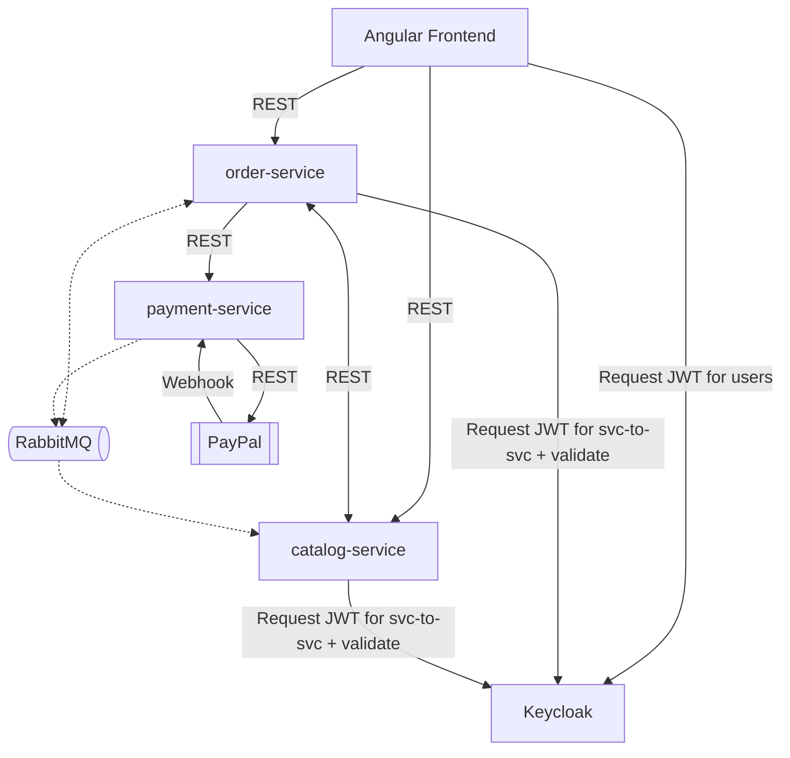
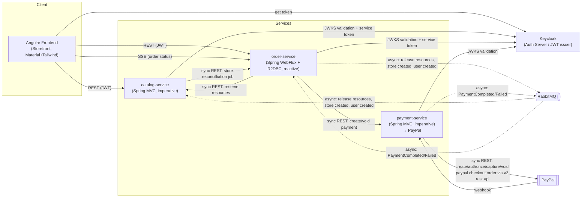

# StoreHub

StoreHub is a multi-tenant e-commerce SaaS enabling vendors to launch independent storefronts — vendors list products
and accept
payments, customers browse multi-store catalogs and place orders.

Below a demo video for the checkout flow for a connected user and a guest user.
[](https://www.youtube.com/watch?v=oHGmZVkBGxE)

This diagram present an overview of the different system component and how they communicate.



## Features

- Create a customer account
- Create owner account
- Create Store
- Browse stores catalog of products
- Apply filters to products
- Shareable pages and filters
- Browse products as guest or connected
- Persistent cart across devices
- Responsive Design, it works on desktop (1440px) and mobile screens (375px) screens.
- Place orders
- Cancel a paid order and get a refund
- Browse and choose stores
- Track order state realtime , for guest and connected user
- Benefit from available discounts
- Online payment with PayPal
- Specify a delivery slot to your order

## Backend Capabilities

Here is a list of store owners operations

- Create products with initial quantity
- Update products stock
- Create products categories
- Create sale events
- Create and update slot configurations, and have materialized slots generated automatically
- Override specific generated slots (e.g. edit capacity)
- refund a captured payment
- Capture an authorized payment
- Authorize an approved payment

## Architecture

The system is composed of three independently deployable Spring Boot services plus an Angular frontend, coordinating
through a mix of synchronous REST and asynchronous messaging.

### Detailed Diagram



### Why these choices

**Microservices, deliberately, for a portfolio project**
Chosen to practice service boundaries and polyglot communication (blocking REST +
reactive) — accepting the added deployment and operational complexity that comes with it. At this scale, a real
production system would likely start as a modular monolith and split only once actual scaling or team-ownership pressure
justified it.

**WebFlux for order-service, Spring MVC for catalog and payment services**
order-service acts as the orchestrator — it interacts with nearly every other component (catalog, payment, RabbitMQ) —
making a non-blocking stack a good fit for coordinating multiple concurrent downstream calls without tying up threads.
It was also a deliberate opportunity to get hands-on with reactive programming and R2DBC.

**Sync REST for resource(stock and delivery slots) reservation and payment creation, async events for compensating
actions**
Reservation and payment creation are on the critical path and need an immediate response to the caller. Reservation
release (on failure) and payment status updates are eventually-consistent side effects, decoupled via RabbitMQ so the
critical path doesn't block on them.

**No API gateway**
Frontend calls each service directly. Acceptable at this scope; a production multi-tenant system would typically front
services with a gateway for centralized routing and rate-limiting.

**Multi-tenancy: shared schema with `store_id`**
All tenant data lives in shared tables scoped by a `store_id` column, rather than schema-per-tenant or separate
databases. Simpler to operate and query across tenants, at the cost of relying on application-level enforcement..

**Database for each service**
Each microservice has a database, this splits each microservice boundaries, they're linked via resource ids.
Though catalog service has as shadow for user and store tables of order service, because the creation of those are done
in order
service but the catalog service needs them for admin business logic(adding a product, or slot config etc...), catalog is
updated via
events emitted by order for each new store or user creation, this way catalog is in sync with order state. As a safety
net , catalog has a reconciliation
job for stores, a scheduled job run each day and grab a of store from order and compare state

## Tech Stack

The project is built with spring boot for backend and angular for frontend, with postgres as the DBMS and RAbbitMQ as
the event broker and wiremock for sever mocking and keyclaok for auth
order-serice: Spring Boot, Webflux, R2DBC (
with [spring-r2dbc-relationships](https://github.com/JoseLion/spring-r2dbc-relationships) for entities relationships),
Spring Security, webclient
catalog-service: Spring Boot, Servlet, JDBC, restClient
payment-service: Spring Boot, Servlet, JDBC and PayPal as the payment service provider
Message broker: Rabbit MQ
Mock server for local development and end to end testing: wiremock
Database Management System: Postgres
frontend: Angular with angular Material, Tailwind Css and signal store as the state management solution
Authentication: self-hosted Keycloak as the IAM server
Containerization: Docker and docker compose to manage the different system component in one place
Testing: Mockito, wiremock, mvcTestClient

## Getting Started

### Prerequisites

Add this entry to your hosts file (required for Keycloak OAuth redirects):

`/etc/hosts`:
`127.0.0.1  auth-server`

### Configuration

Default ports are below. If any conflict with services already running on your machine, override them in `.env`:

\```bash
cp .env.example .env
\```
TODO: add a .env.example file that has the below env variables

| Service                            | Default Port | Env Var        |
|------------------------------------|--------------|----------------|
| Frontend                           | 4200         | FRONTEND_PORT  |
| Order Service                      | 8090         | ORDER_PORT     |
| Payment Service                    | 8200         | PAYMENT_PORT   |
| Rabbit MQ Client Messaging         | 5672         | MQ_PORT_CLIENT |
| Rabbit MQ Management Web Interface | 15627        | MQ_PORT_WEB    |
| Keycloak                           | 8088         | KC_PORT        |
| Keycloak Management Interface      | 9000         | KC_HEALTH_PORT |
| Catalog Service                    | 8100         | CATALOG_PORT   |

### Quick Start

Get the platform running with a demo PayPal sandbox, no PayPal account needed.

\```bash
docker compose -f compose.quickstart.yml up
\```
TODO: try the the compose file out
Then visit `http://localhost:4200`.

> **Note:** This uses a shared demo PayPal sandbox app. You can walk through the full checkout flow( including PayPal
> login and approval) but **order authorization won't complete**, since it depends on a webhook reaching this app, which
> isn't possible without your own public tunnel. See [Full Checkout Setup](#full-checkout-setup) below to enable it.

---

### Full Checkout Setup (optional)
To see the complete flow, including order authorization, use your own PayPal sandbox app and a tunnel to receive its webhook.

1. **Create a PayPal sandbox app**
   Sign up at [developer.paypal.com](https://developer.paypal.com) → create a sandbox REST app → copy the Client ID and Secret.

2. **Set your credentials**
   \```bash
   cp .env.example .env
   # fill in PAYPAL_CLIENT_ID and PAYPAL_CLIENT_SECRET
   \```

3. **Start a tunnel** to payment service port
   \```bash
   ngrok http 8200


## Project Structure

storehub  
\_backend
| \_catalog-service
| \_order-service
| \_payment-service
\_frontend
\_keycloak
\_wiremock

## API Docs

(Swagger/OpenAPI links)

## Testing

In this section, end to end testing is discussed, for microservices independent tests, go to each microservice docs

## End-to-end testing

E2e testing is done with `cypress`.
`compose.e2e.yml` spins up the infrastructure needed to run e2e tests.
Since no migration strategy is set for `order-service`, manual setup is needed each time the schema changes.
The current approach uses the postgres image's `/docker-entrypoint-initdb.d` to run an init script.
The init script lives at `./backend/order-service/src/main/resources/init-scripts` and is generated with:

```shell
pg_dump \
  -h localhost \
  -p 5432 \
  -U postgres \
  -d order_db \
  --schema-only \
  --no-owner \
  --no-privileges \
  --no-tablespaces \
  --no-comments \
  -f schema_dump.sql
```

The checkout flow e2e test assumes the pre-existence of two stores, two users, and products — that's why the seed
script (`cypress/e2e/seed/seed.cy.ts`) must be run before the checkout flow test.
The checkout flow tests are designed to run sequentially; they are not independent.

### Run checkout flow end-to-end test

This test does the following, in order:

- Visits the `/welcome` page and asserts it shows the two CTAs: Login and Create An Account.
- Tries to create an account with an already existing email and asserts that an error is shown.
- Signs up with a new email, then logs in through Keycloak, asserting the login succeeded.
- Asserts a redirect to `/welcome-pick-store` happens, and picks a store.
- Performs actions on the cart, then clicks the continue checkout button.
- Fills in the checkout form and places the order (`*`).
- Intercepts the response from the order service and replaces the value of `paymentApprovalUrl` into
  the track order URL, so the frontend skips the redirect and goes straight to the track order page.
- Asserts the order status is `CREATED` on the track order page.
- Simulates a PayPal webhook and watches for order status changes, to test SSE and live status updates.

To run the test, the app needs data (stores, users, products, etc.), so we run the seed script first.
To perform the end-to-end test, run:

```shell
docker compose -f compose.e2e.yml -f frontend.override.yml down
docker compose -f compose.e2e.yml -f frontend.override.yml up -d --build
cd frontend/ && npx cypress run --spec "cypress/e2e/seed/seed.cy.ts"
npx cypress run --spec "cypress/e2e/checkout-flow/checkout-flow.cy.ts"
```

or

```shell
make e2e
```

`*`: PayPal is mocked using WireMock for the order creation endpoint, OAuth token, and webhook verification. The mock
returns a mocked approval URL containing a token; the order service saves that token alongside the order. When the
frontend receives the redirect URL, it replaces it with the track order page URL, passing the payment token as a query
param (`paymentOrderId`).

## Seed

To seed the running `compose.e2e.yml` project with stores, users, and products, run (from the frontend directory):

```shell
cd frontend
npx cypress run --config baseUrl=http://localhost:4200 --spec "cypress/e2e/seed/seed.cy.ts"
```

## Frontend dev using e2e compose file and seed script

To run your dev frontend:

```shell
ng serve --configuration e2e
export FRONTEND_URL=http://localhost:4200
export PAYPAL_BASE_URL=https://api.sandbox.paypal.com
docker compose -f compose.e2e.yml -f frontend.override.yml up -d
docker compose -f compose.e2e.yml -f frontend.override.yml stop frontend
```

Note: make sure to set `FRONTEND_URL`, or the order and catalog services will reject frontend requests due to CORS.

## Auth setup for local/e2e

Keycloak must be reachable at the same hostname:port from both the browser and backend containers, or JWTs will fail
issuer validation (401 "iss claim is not valid").

1. Add this to your hosts file (`/etc/hosts`):

```shell
127.0.0.1  auth-server
# needed so the browser can resolve auth-server, same as Docker's
# internal DNS does for backend containers
```

2. Keycloak's internal listening port must match its published port (see `keycloak/compose.e2e.yml`:
   `KC_HTTP_PORT=8088`, `ports: "8088:8088"`).

3. All backend services and the frontend must use `http://auth-server:8088/realms/storehub` as the Keycloak base URL —
   not `localhost`, not port `8080`.

## Roadmap