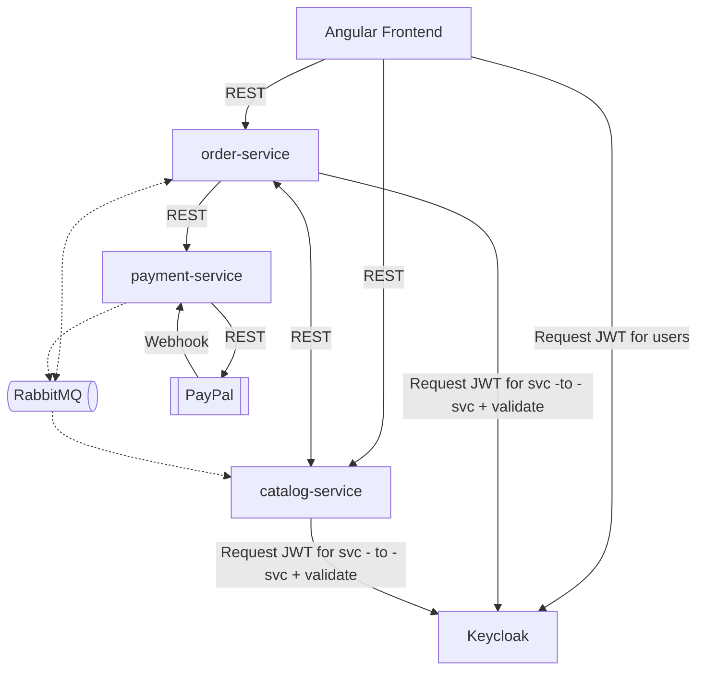
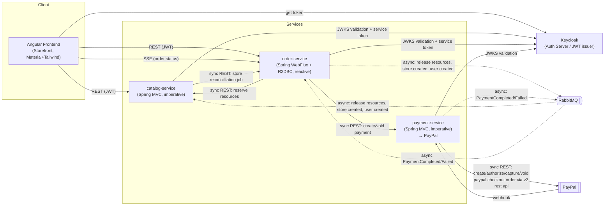

# StoreHub

StoreHub is a multi-tenant e-commerce SaaS enabling vendors to launch independent storefronts — vendors list products
and accept payments, customers browse multi-store catalogs and place orders.

Below is a demo video of the checkout flow for a connected user and a guest user.
[](https://www.youtube.com/watch?v=oHGmZVkBGxE)

This diagram present an overview of the different system component and how they communicate.



## Features

- Create a customer account
- Create an owner account
- Create a store
- Browse a store's catalog of products
- Apply filters to products
- Shareable pages and filters
- Browse products as a guest or connected user
- Persistent cart across devices
- Responsive design, works on desktop (1440px) and mobile (375px) screens
- Place orders
- Cancel a paid order and get a refund
- Browse and choose stores
- Track order status in real time, for guest and connected users
- Benefit from available discounts
- Pay online with PayPal
- Specify a delivery slot for an order

## Backend Capabilities

Store owner operations:

- Create products with initial stock
- Update product stock
- Create product categories
- Create sale events
- Create and update slot configurations, with materialized slots generated automatically
- Override specific generated slots (e.g. edit capacity)
- Refund a captured payment
- Capture an authorized payment
- Authorize an approved payment

## Architecture

The system is composed of three independently deployable Spring Boot services plus an Angular frontend, coordinating
through a mix of synchronous REST and asynchronous messaging.

### Detailed Diagram



### Why these choices

**Microservices, deliberately, for a portfolio project**
Chosen to practice service boundaries and polyglot communication (blocking REST +
reactive), accepting the added deployment and operational complexity that comes with it. At this scale, a real
production system would likely start as a modular monolith and split only once actual scaling or team-ownership pressure
justified it.

**WebFlux for order-service, Spring MVC for catalog and payment services**
order-service acts as the orchestrator, it interacts with nearly every other component (catalog, payment, RabbitMQ) —
making a non-blocking stack a good fit for coordinating multiple concurrent downstream calls without tying up threads.
It was also a deliberate opportunity to get hands-on with reactive programming and R2DBC.

**Sync REST for resource(stock and delivery slots) reservation and payment creation, async events for compensating
actions**
Reservation and payment creation are on the critical path and need an immediate response to the caller. Reservation
release (on failure) and payment status updates are eventually-consistent side effects, decoupled via RabbitMQ so the
critical path doesn't block on them.

**No API gateway**
Frontend calls each service directly. Acceptable at this scope; a production multi-tenant system would typically front
services with a gateway for centralized routing and rate-limiting.

**Multi-tenancy: shared schema with `store_id`**
All tenant data lives in shared tables scoped by a `store_id` column, rather than schema-per-tenant or separate
databases. Simpler to operate and query across tenants, at the cost of relying on application-level enforcement..

**Database for each service**
Each microservice has a database, this splits each microservice boundaries, they're linked via resource ids.
Though catalog service has as shadow for user and store tables of order service, because the creation of those are done
in order
service but the catalog service needs them for admin business logic(adding a product, or slot config etc...), catalog is
updated via
events emitted by order for each new store or user creation, this way catalog is in sync with order state. As a safety
net , catalog has a reconciliation
job for stores, a scheduled job run each day and grab a of store from order and compare state

## Tech Stack

The project is built with Spring Boot for the backend and Angular for the frontend, with Postgres as the DBMS,
RabbitMQ as the event broker, WireMock for server mocking, and Keycloak for authentication.

- `order-service`: Spring Boot, WebFlux, R2DBC (
  with [spring-r2dbc-relationships](https://github.com/JoseLion/spring-r2dbc-relationships) for entity relationships),
  Spring Security, WebClient
- `catalog-service`: Spring Boot, Servlet, JDBC, RestClient
- `payment-service`: Spring Boot, Servlet, JDBC, with PayPal as the payment service provider
- Message broker: RabbitMQ
- Mock server for local development and end-to-end testing: WireMock
- Database management system: Postgres
- Frontend: Angular with Angular Material, Tailwind CSS, and SignalStore as the state management solution
- Authentication: self-hosted Keycloak as the IAM server
- Containerization: Docker and Docker Compose to manage the system's components in one place
- Testing: Mockito, WireMock, MockMvc/WebTestClient and StepVerifier for reactive code.

## Getting Started

### Prerequisites

Add this entry to your hosts file (required for Keycloak OAuth redirects):

`/etc/hosts`:
`127.0.0.1  auth-server`

### Configuration

Default ports are below. If any conflict with services already running on your machine, override them in `.env`:

```bash
cp .env.example .env
```

| Service                            | Default Port | Env Var        |
|------------------------------------|--------------|----------------|
| Frontend                           | 4200         | FRONTEND_PORT  |
| Order Service                      | 8090         | ORDER_PORT     |
| Payment Service                    | 8200         | PAYMENT_PORT   |
| Catalog Service                    | 8100         | CATALOG_PORT   |
| Keycloak                           | 8088         | KC_PORT        |
| Rabbit MQ Client Messaging         | 5672         | MQ_PORT_CLIENT |
| Rabbit MQ Management Web Interface | 15627        | MQ_PORT_WEB    |
| Keycloak Management Interface      | 9000         | KC_HEALTH_PORT |

### Quick Start

Get the platform running with a demo PayPal sandbox, no PayPal account needed.

```bash
make quickstart
```

Then visit `http://localhost:4200`.

> **Note:** This uses a shared demo PayPal sandbox app. You can walk through the full checkout flow( including PayPal
> login and approval) but **order authorization won't complete**, since it depends on a webhook reaching this app, which
> isn't possible without your own public tunnel. See [Full Checkout Setup](#full-checkout-setup-optional) below to
> enable it.

Demo user to use for PayPal checkout(safe to share since this is a demo account for testing):

- `sb-zxprs52773167@personal.example.com`:`B+]cB>6p`

---

### Full Checkout Setup (optional)

To see the complete flow, including order authorization, use your own PayPal sandbox app and a tunnel to receive its
webhook.

1. **Create a PayPal sandbox app**
   Sign up at [developer.paypal.com](https://developer.paypal.com) → create a sandbox REST app → copy the Client ID and
   Secret.

2. **Set your credentials**
   ```bash
   cp .env.example .env
   # fill in PAYPAL_CLIENT_ID and PAYPAL_CLIENT_SECRET
   ```

3. **Start a tunnel** to payment service port

```bash
ngrok http 8200 
```

Copy the generated `https://*.ngrok-free.app` URL.

4. **Register the webhook**
   In your sandbox app settings, add a webhook pointing to:
   `https://<your-ngrok-url>/api/payments/paypal/webhook`
   Subscribe to these events:

- Checkout order approved
- Payment authorization created
- Payment authorization voided
- Payment capture completed
- Payment capture refunded
- Payment order created .

5. Then add `PAYPAL_WEBHOOK_ID` to the env file
6. **Run the platform**

```bash
make quickstart
```

Checkout will now complete end-to-end, including payment authorization.

### Auth Configuration (Local/E2E)

Keycloak must be reachable at the same hostname:port from both the browser and backend containers, or JWTs will fail
issuer validation (401 "iss claim is not valid").

1. Add this to your hosts file (`/etc/hosts`):

```shell
127.0.0.1  auth-server
# needed so the browser can resolve auth-server, same as Docker's
# internal DNS does for backend containers
```

2. Keycloak's internal listening port must match its published port (see `keycloak/compose.e2e.yml`:
   `KC_HTTP_PORT=8088`, `ports: "8088:8088"`).

3. All backend services and the frontend must use `http://auth-server:8088/realms/storehub` as the Keycloak base URL,
   not `localhost`.

### Developing Frontend Against E2E Stack

To run your dev frontend:

```shell
ng serve --configuration e2e                                            # start dev server
export FRONTEND_URL=http://localhost:4200                               # allowed origins by order service and catalog service
export PAYPAL_BASE_URL=https://api.sandbox.paypal.com                   # domain payment service hit to create payment orders etc...
docker compose -f compose.e2e.yml -f frontend.override.yml up -d        # run compose project
docker compose -f compose.e2e.yml -f frontend.override.yml stop frontend  # frontend service not needed
```

Note: make sure to set `FRONTEND_URL`, or the order and catalog services will reject frontend requests due to CORS.

## Project Structure

```text
storehub/
├── backend/
│   ├── catalog-service/
│   ├── order-service/
│   └── payment-service/
├── frontend/
├── keycloak/
├── wiremock/                    # mock server used for e2e
├── scripts/                     # currently contains the seed script for quickstart
├── compose.e2e.yml              # compose file for e2e testing
├── compose.quickstart.yml       # compose file for quickstart
├── frontend.override.yml        # override used by compose.e2e
└── Makefile

```

## API Docs

Each service exposes its own OpenAPI/Swagger UI when running locally:

| Service         | Swagger UI                                    |
|-----------------|-----------------------------------------------|
| catalog-service | `http://localhost:8100/swagger-ui/index.html` |
| order-service   | `http://localhost:8090/swagger-ui/index.html` |
| payment-service | `http://localhost:8200/swagger-ui/index.html` |


## Testing

This section covers end-to-end testing. For each microservice's unit/integration tests, see its own docs:

- Link to order-service test section
- Link to catalog-service test section
- Link to payment-service test section
- Link to frontend test section

### End-to-End Testing

E2e testing is done with `cypress`.
`compose.e2e.yml` spins up the infrastructure needed to run e2e tests.
`order-service` currently requires manual schema setup for e2e — see the
[order-service docs](backend/order-service/README.md#schema-setup-for-e2e) for details.

The checkout flow e2e test assumes the pre-existence of two stores, two users, and products, which is why the seed
script (`cypress/e2e/seed/seed.cy.ts`) must be run before the checkout flow test.
The checkout flow tests are designed to run sequentially — they are not independent.

#### Seeding Test Data

To seed the running `compose.e2e.yml` project with stores, users, and products, run (from the frontend directory):

```shell
cd frontend
npx cypress run --config baseUrl=http://localhost:4200 --spec "cypress/e2e/seed/seed.cy.ts"
```

#### Running the Checkout Flow Test

This test does the following, in order:

- Visits the `/welcome` page and asserts it shows the two CTAs: Login and Create An Account.
- Tries to create an account with an already existing email and asserts that an error is shown.
- Signs up with a new email, then logs in through Keycloak, asserting the login succeeded.
- Asserts a redirect to `/welcome-pick-store` happens, and picks a store.
- Performs actions on the cart, then clicks the continue checkout button.
- Fills in the checkout form and places the order. At this step, order-service calls payment-service to create the
  payment, which in turn calls PayPal. Since PayPal is an external dependency, it is mocked to keep the test
  deterministic — see [Payment Mocking](#payment-mocking).
- Intercepts the response from order-service and replaces the value of `paymentApprovalUrl` in the track-order URL,
  so the frontend skips the redirect and goes straight to the track order page.
- Asserts the order status is `CREATED` on the track order page.
- Simulates a PayPal webhook and watches for order status changes, to test SSE and live status updates.

To run the test, the app needs data (stores, users, products, etc.), so the seed script must run before the test
script.
To perform the end-to-end test, run:

```shell
docker compose -f compose.e2e.yml -f frontend.override.yml down
docker compose -f compose.e2e.yml -f frontend.override.yml up -d --build
cd frontend/ && npx cypress run --spec "cypress/e2e/seed/seed.cy.ts"
npx cypress run --spec "cypress/e2e/checkout-flow/checkout-flow.cy.ts"
```

or simply:

```shell
make e2e
```

#### Payment Mocking

PayPal is mocked using WireMock for the order creation endpoint, OAuth token, and webhook verification. When order
creation endpoint is hit, the mock returns a mocked approval URL containing a token; order-service saves that token
alongside the order. When the frontend receives the redirect URL, it replaces it with the track-order page URL, passing
the payment token as a query param (`paymentOrderId`).

## Roadmap

There is missing pieces that needs to be done before calling this project as completed, also there is things that are
not necessary but will serve as good improvements.

### Planned Features

The main piece not yet built is the admin panel. Some of its backend logic already exists
([Backend Capabilities](#backend-capabilities)), but no frontend has been built for it yet. Admin features will be
tackled after the customer-facing features are complete.

**Decision: separate Angular app, within an Nx workspace**

The admin backoffice will be built as a separate Angular application rather than integrated into the existing
customer-facing app, using an Nx workspace to manage both projects together. Reasons:

- Different bundle-size needs, the customer storefront must ship lean for SEO/mobile; the admin panel doesn't
- Different deploy cadences and risk, a bad admin deploy shouldn't be able to affect checkout
- Cleaner routing/guards, no risk of admin routes leaking into the public bundle
- Independent restarts, an admin-only change won't require restarting the customer app

The trade-off accepted: running two apps adds some operational overhead (two builds, two deploy targets) compared to
a single shared app, but this is judged worth it given how little logic is actually shared between admin and
customer flows, and the reasons listed above.

### Improvements

Nice-to-haves that aren't required for completion but would strengthen the project:

- **Caching between order-service and catalog-service**: avoid calling catalog-service on every cart update by
  caching product details in order-service. The cache would only be updated when a product becomes unavailable, with
  catalog-service signaling the change; a direct call to catalog-service would then only be needed at checkout.
  (Details to move to order-service docs.)
- **Rate limiting per IP**
- **Employee accounts**: allow a store owner to add employees: users with permission to manage products, update
  stock, and view the order list, without full owner access.